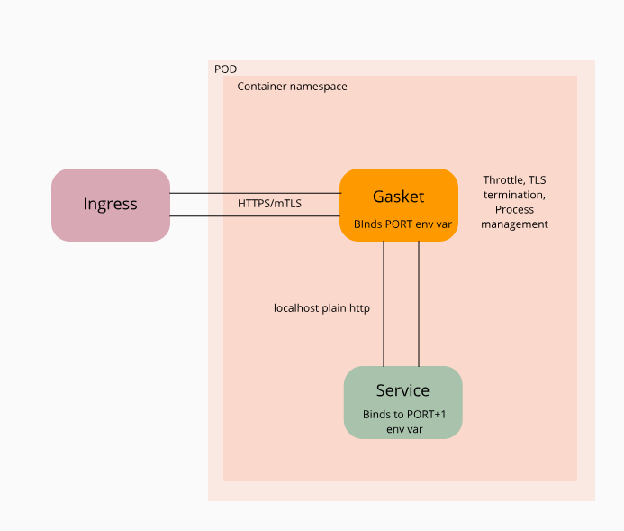

### Gasket - container proxy and PID1 manager

#### What is it ?

Gasket is both a proxy which can terminate TLS and mTLS connections and a PID1 manager.

#### How ?

- Use it as the container ENTRYPOINT to wrap any 12 factor service or application.

- Gasket behaves as a PID1 manager: after starting it will spin up the https endpoing, translate the received environment variables and spawn the service

- Gasket also does signal management and process supervision - if the process dies it will restart it up until a configurable limit.

- Gasket is meant to be used with 12 Factor applications - It will listen to the PORT number indicated by the PORT env variable and will make the original service listen in the localhost on PORT + 1. 

#### Traffic flow

#### Why ?

I wanted to have tls and mtls termination at the container and experiment with Rust to do it. I didn't wanted to adopt a Service Mesh for that and I believe that the mix of cgroups, namespaces and linux allow for a powerful ENTRYPOINT management tool to help on that.

#### Build
$ cargo build --release
